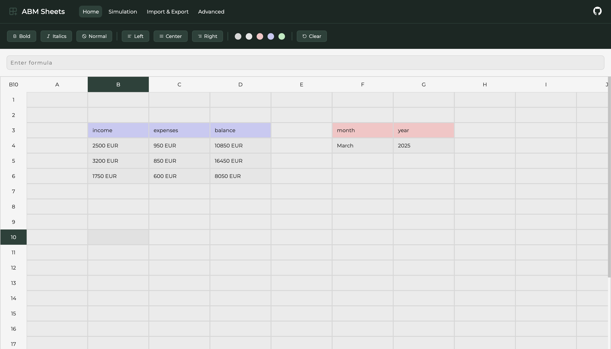
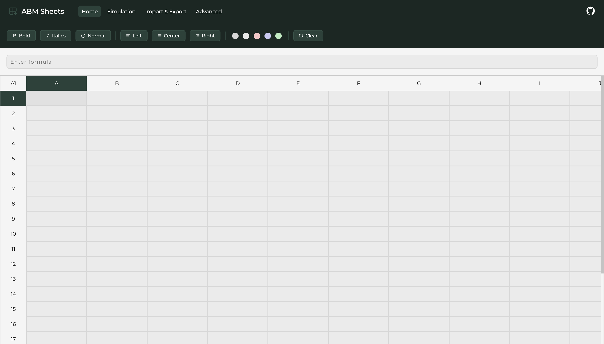
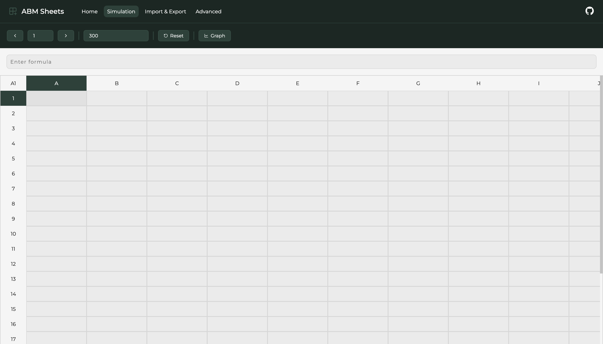
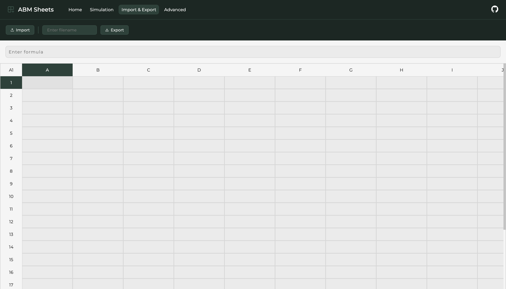
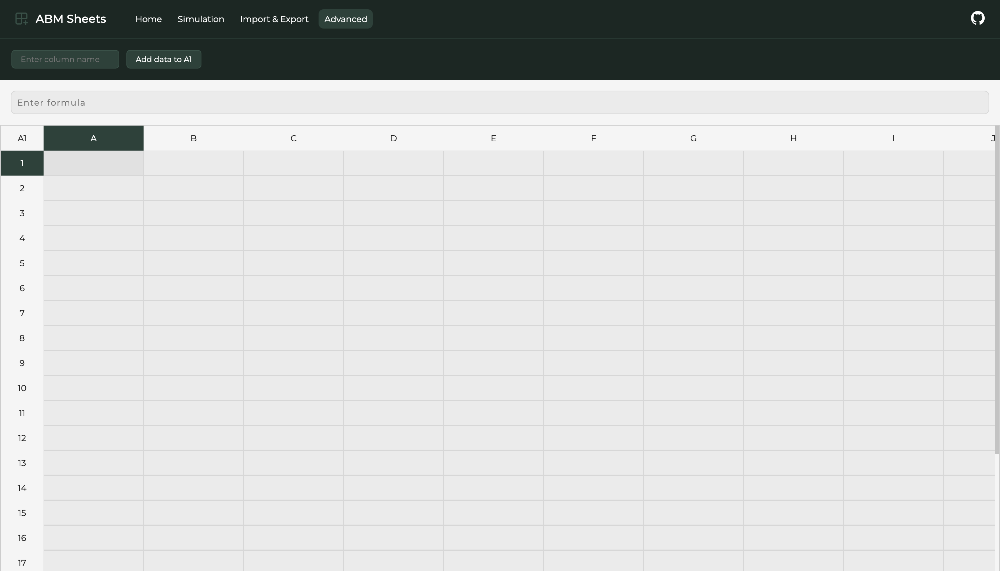

# Technical Specification

| Project    | Author         | Supervisor                 | Date          | Version |
| ---------- | -------------- | -------------------------- | ------------- | ------- |
| ABM Sheets | Bc. Tomáš Boďa | Mgr. Tomáš Petříček, Ph.D. | May 11, 2025  | 1.0     |

## Introduction

This document serves as technical specification for the ABM Sheets research project.

ABM Sheets is a web-based application that enables users to create simulation models using a spreadsheet interface similar to Microsoft Excel or Google Sheets. It provides a two-dimensional grid of cells, where the cells can hold values that are calculated based on their formulas. However, the main benefit of ABM Sheets is that it provides built-in discrete time, which enables a step-wise execution of the model, where cells can reference themselves inside their formulas and calculate new values based on values from the previous steps. This adds a new dimension of time to the models, which can be beneficial for many types of simulations which are difficult to model using traditional spreadsheet software systems.

ABM Sheets is not a complete, production-ready solution. It rather serves as a proof-of-concept of using discrete time in spreadsheet interfaces to handle more complex simulations. It is intended for scientists and researches specializing in simulation modeling and spreadsheet software with the purpose of testing the idea of adding time to spreadsheet interfaces.

## Background & Motivation

Some types of models and simulations require multiple dimensions, such as agent-based models. In agent-based models, there is a set of agents that interact with each other. Each agent holds a set of attributes. Agent-based simulations are executed in a step-wise manner, where each agent's attributes are recalculated in each step based on the current state of the model. This paradigm introduces three dimensions to the model - the dimension of agents, agent attributes and discrete time. This is, however, difficult to model in current spreadsheet interfaces, since spreadsheets provide only a two-dimensional grid of cells. If we wanted to map an agent-based model to a two-dimensional grid, we would need to duplicate the first two dimensions for each entity of the third dimension. For instance, if we choose to represent rows as agents and columns as their attributes, each time step needs be represented by a replicated table of agents and their attributes with new, updated values. This is very inconvenient for larger and more complex models.

This is where the idea of ABM Sheets come into play. It introduces built-in discrete time, which hides the third dimension of time into the spreadsheet itself. In this way, cells can reference themselves in their formulas, taking their value from the previous step and calculating their new value based on its previous value. This adds the possibility of modeling three-dimensional simulations inside a two-dimensional spreadseet, opening new possibilities of robust modeling. The goal of ABM Sheets is to simplify modeling complex simulations using a well-known spreadsheet interface, familiar to many scientists working with Microsoft Excel on daily basis.

## System Overview

ABM Sheets is a web-based application built purely in TypeScript. It's front-end is built in the Next.js framework, which is built on top of the React.js library. The computational engine of the spreadsheet is a part of the project and runs purely in the browser. Its performance is sufficient for simpler simulations that are used to validate this proof-of-concept.

## Functional Requirements

Below is a list of functional requirements of the software system:

1. the system provides a two-dimensional grid of cells to the user

2. the system allows the user to input a static, plain text value to a cell
3. the system allows the user to input a formula to a cell, which is automatically calculated
    - a formula always starts with the `=` symbol
    - a formula with two `=` symbols is interpreted as follows:
        - formula after the first `=` symbol is the initial, default value of the cell which is used in step `1`
        - formula after the second `=` symbol is the formula which is used in steps `2...n`

4. the system allows the user to step through the steps of the simulation
    - in each step, newly calculated values are displayed in the corresponding cells
5. the system allows the user to set the maximum number of steps of the simulation
6. the system allows the user to reset the current step to step `1` (the first step)

7. the system allows the user to export the current model to a local `.json` file
8. the system allows the user to import a model in `.json` format

9. the system allows the user to import a `.csv` file to a specific cell as static data
    - the user specifies the name of the column to be used from the `.csv` file
    - as the user steps through the simulation, the values change based on the data of the `.csv` file columns

10. the system allows the user to make a multi-cell selection
    - cells in the selection are highlighted
11. the system allows the user to copy all values/formulas of cells in the selection
12. the system allows the user to paste all copies values/formulas of cells in the selection to the current selected cell/cells
    - all cell references in the cell formulas are shifted based on the offset from the copied cells to the pasted cells
13. the system allows the user to remove all values/formulas from cells in the selection

14. the system allows the user to drag a selection of cells to either bottom or right to copy and paste cell contents to other cells
    - all cell references in the cell formulas are shifted based on the offset from the copied cells to the pasted cells

15. the system allows the user to change the background color of cells in the selection to one of the provided colors
16. the system allows the user to change the font type of cells in the selection to one of - `bold`/`italic`/`normal`
17. the system allows the user to clear all styling of cells in the selection

18. the system re-evaluates the cells on each change
    - on each cell formula change
    - on each cell value change

## Formula Language

The formula language in ABM Sheets is almost identical to the one used in Microsoft Excel.

### Formulas

To define a cell formula, type in the `=` symbol followed by the actual formula value. In ABM Sheets, there are two types of formulas:

1. default formula
2. primary formula

If the cell input contains only one `=` symbol, it is treated as a primary formula only. This formula is used in all steps of the simulation. If the cell input contains two `=` symbols, the formula after the first `=` symbol is treated as the default formula, whereas the formula after the second `=` symbol is treated as the primary formula.

The main difference is that the default formula, if specified, is used in the first simulation step only. After the first step, all consequetive steps use the primary formula. The reason behind introducing default formula's is the possibility to self-reference a cell. If cell `A1` references itself in its formula, the cell's value from the previous step needs to be used in the evaluation of the current step. Therefore, all cells that reference themselves in their primary formulas need to have the default formula provided.

For instance, suppose cell `A1` with the input formula being `= 1 = A1 + 1`.
    - in the first step, `A1` has value `1`
    - in the second step, it takes its previous value and adds `1` to it, so it becomes `2`
    - in the third step, it takes the previous value `2` and adds `1` to it, so it becomes `3`

If the default formula was not provided, `A1` could not take the previous value of `A1` in the first step, since it would not exist, resulting in an error.

Moreover, if there is a cyclic dependency, for instance:
    - `A1` formula is `= B1`
    - `B1` formula is `= A1`

This situation cannot be sorted topologically, resulting in an error. However, if one of these cells had a default formula provided, it would break the cycle in the topological sort and could be evaluated. For instance:
    - `A1` formula is `= 0 = B1`
    - `B1` formula is `= A1`

In this situation, `A1` is evaluated first, holding the value of `0`, then `B1` is evaluated, taking the value `0` from `A1`.

### Cell References

A cell can reference another cell in its formula by using its identifier (row and column), for instance `C6`.

Cell references can also be fixed. The user can fix either the column or the row of the reference. If any of these is fixed, it will not shift the reference when copying or dragging the cell. To fix a column or a row, use the `$` sign before the column or the row. For instance:
    - `$C6` fixes the column `C`
    - `C$6` fixes the row `6`
    - `$C$6` fixes both the row and the column

### Functions

ABM Sheets provides a subset of Microsoft Excel built-in functions.

#### Logical Functions

The list of logical functions includes `if`, `and`, `or`.

- `if` - takes in a boolean value (condition), a consequetive value (condition is true) and an alternate value (condition is false)
- `and` - takes any number of boolean arguments and returns the result of their conjunction
- `or` - takes any number of boolean arguments and returns the result of their disjunction

#### Cell Functions

The list of cell functions includes `index`, `match`, `min`, `max`, `sum`, `average`, `count`, `countif`.

- `index` - takes a cell range as the first argument and number `n` as the second argument and returns the value of `n`-th cell in the cell range
- `match` - takes any value as the first argument and a cell range as the second argument and returns the offset of the cell in the cell range that holds the given value (if none is found, `-1` is returned)
- `min` - takes a cell range and returns the minimum numeric value from the cell range
- `max` - takes a cell range and returns the maximum numeric value from the cell range
- `sum` - takes a cell range and returns the sum of all numeric values in the cell range
- `average` - takes a cell range and returns the average of all numric values in the cell range
- `count` - takes a cell range and returns the total number of cells that hold a value in the cell range
- `countif` - takes a cell range and any value and returns the total number of cells that hold the provided value in the cell range

#### Mathematical Functions

The list of mathematical functions includes `abs`, `floor`, `ceiling`, `power`, `mmin`, `mmax`, `rand`, `randbetween`, `choice`.

- `abs` - takes a numeric value and returns its absolute value
- `floor` - takes a numeric value and returns its floor value
- `ceiling` - takes a numeric value and returns its ceiling value
- `power` - takes two numeric values and returns the first argument to the power of the second argument
- `mmin` - takes any number of values and returns the minimum value
- `mmax` - takes any number of values and returns the maximum value
- `rand` - returns a random number between `0` and `1`
- `randbetween` - takes two integer arguments and returns a random integer in that range
- `choice` - takes any number of values and returns a random value of the provided values

#### String Functions

The list of string functions includes `concat`.

- `concat` - takes any number of values and returns a concatenated string of the values

#### Simulation Functions

The list of simulation functions includes `prev`, `history`, `sumhistory`, `step`.

- `prev` - takes a cell reference and returns the cell's value from the previous step
- `history` - takes a cell reference and an offset and returns the cell's value from the step in history based on the offset
- `sumhistory` - takes a cell reference and returns the sum of all numeric historical values of the cell
- `step` - returns the current index of the simulation step (zero-based)

## Architecture

### User Interface

The user interface of the system is built in the Next.js framework, which is built on top of the React.js library. It uses React.js components styled using the Styled Components library (CSS in JS).

### Engine

The evaluation engine is the "back-end" part of the system. It is responsible for evaluating the cell formulas and returning the calculated values. It receives a set of cells and their formulas, forwards them through a set of processors and returns a list of calculated values for each cell and time step.

There are four processors through which the cell formulas go through before being fully evaluated:

1. **lexer** - provides lexical analysis
2. **parser** - provides semantical analysis
3. **runtime** - evaluates the formulas
4. **evaluator** - wrapper that handles cells and time steps

#### Lexer

The lexer receives a raw formula in string format as the input. It iterates over the characters of the formula and groups them into tokens. A token represents a single, non-divisible unit of the formula language, such as identifier, numeric literal, parenthesis, comma and so on. Its primary purpose is to provide a clean representation of the cell formula, omitting all whitespaces and unimportant characters that do not have any impact on the result. Its output is an array of tokens generated from the input formula.

A token consists of a specific type and raw, string value:

```ts
export type Token = {
    type: TokenType;
    value: string;
};
```

Below are the possible token types:

```ts
export enum TokenType {
    Identifier, Number, Boolean, String,
    OpenParen, CloseParen,
    BinOp, RelOp,
    Comma, Dot, Colon,
};
```

#### Parser

The parser receives an array of tokens and analyses it from the semantical point of view. It is a finite automaton which validates the correctness of the input, meaning that the formula conforms the grammar rules of the formula language. For instance, it validates that the `+` binary operators has both left and right operands or that a function call starts with an identifier, followed by an open parenthesis, a list of arguments separated by commas, finally ending with a close parenthesis. As it validates the input, it produces a semantical representation of the formula - an abstract syntax tree (henceforth referred to as the AST). Each node in the AST represents one operation and its children are its operands. If the formula conforms the grammar rules of the formula language, the parser returns a valid AST.

The finite automaton validating the input formula and producing the AST is implemented as a pushdown automaton. It is a top-down recursive descent parser, where each function represents one grammar rule being verified. These functions nest to each other, representing the recursive manner of the formula language grammar.

Each function of the parser represents one grammar rule:

```ts
export class Parser {

    public parse(formula: string): Expression {
        this.tokens = Lexer.tokenize(formula);
        return this.parseExpression();
    }

    private parseExpression(): Expression {
        return this.parseAdditiveExpression();
    }

    private parseAdditiveExpression(): Expression { ... }

    private parseMultiplicativeExpression(): Expression { ... }

    ...

    private parseCallExpression(): Expression { ... }

    private parsePrimaryExpression(): Expression { ... }
}
```

Each grammar rule returns a node of the AST and combines the results of other grammar rules together to form the whole AST:

```ts
export interface BinaryExpression extends Expression {
    type: NodeType.BinaryExpression;
    left: Expression;
    right: Expression;
    operator: string;
}

export interface CallExpression extends Expression {
    type: NodeType.CallExpression;
    identifier: string;
    args: Expression[];
}

...
```

#### Runtime

The runtime receives a valid AST as its input. It goes through the nodes of the AST recursively and evaluates them one by one. The ouput is the final, calculated value of the formula.

```ts
public class Runtime {

    public runFormula(expression: Expression): string {
        const value = this.runExpression(expression);
        ...
        return parsedResult;
    }

    private runExpression(expression: Expression): Value {
        switch (expression.type) {
            case NodeType.BinaryExpression:
                return this.runBinaryExpression(expression as BinaryExpression);
            case NodeType.CallExpression:
                return this.runCallExpression(expression as CallExpression);
            ...
        }
    }

    private runBinaryExpression(expression: BinaryExpression): Value { ... }

    private runCallExpression(expression: CallExpression): Value { ... }

    ...
}
```

#### Evaluator

The evaluator serves as an entry point of the evaluation engine and a wrapper of the above processors. It receives a set of cells and the number of steps as the input. It iterates over all cells and all steps and for each cell and step, it evaluates its formula given the step and saves it to the result. The output of the evaluator is an object referred to as `History`, which is a map of cell IDS and a list of their calculated values for each time step. This object is then used by the fron-end part of the system to render correct values to correct cells in the spreadsheet interface.

```ts
public class Evaluator {

    public evaluateCells(cells: CellId[], steps: number) {
        const history: History = new Map();

        for (let step = 0; step < steps; step++) {
            for (const cellId of cells) {
                const result = this.evaluateCell(cellId, step, history);

                if (!result) {
                    continue;
                }

                history.set(cellId, [...(history.get(cellId) ?? []), result]);
            }
        }

        return history;
    }

    ...
}
```

## Key Algorithms and Logic

### Topological Sorting

Before the evaluation of cells begins, the cells are sorted topologically in the order they are going to be evaluated in. This is due to the fact, that when a cell references some other cell, it must be evaluated after the referenced cell in order to have the most up-to-date value of the referenced cell. If the cells were not sorted topologically before the evaluation beings, cells could have outdated values and the simulation would not provide correct results to the user.

The topological sorting is done in the following way:

- if cell `A1` references cell `B1`, `B1` is evaluated before `A1`
- if cell `A1` references cell `B1` and cell `B1` references cell `A1`, the system throws an error
- if cell `A1` references cell `B1` and cell `B1` references cell `A1` and `A1` has a default formula provied, `A1` is evaluated before `B1`

To sort the cells topologically, the system first extracts cell references from formulas and creates a dependency graph. This dependency is then forwarded to the topological sorting algorithm, which either returns an array of cell IDs in the order in which they should be evaluated, or it throws an error. If an error is thrown, no topological ordering has been found.

## User Interface

ABM Sheets contains only one main page, which contains the spreadsheet interface and a toolbar with all available options.

### Spreadsheet



### Toolbar

#### Home Tab

The Home tab provides options for cell font and color styling. It also provides an option to clear all styling from the current selection.



#### Simulation Tab

The Simulation tab provides the simulation stepper, where the user can step through the simulation steps using the arrow buttons. The user can also set the total number of simulation steps as well as reset the step to the first step.



#### Import & Export Tab

The Import & Export tab allows the user to import a local `.json` file or export the current model to a local `.json` file (and specify the filename).



#### Advanced Tab

The Advanced tab allows the user to import a `.csv` file and specify which column of the `.csv` file to import to the selected cell.



## Keystrokes

The user can use several keystrokes to control the spreadsheet interface.

### Selection

- `Ctrl + A` - selects all cells in the spreadsheet
- `Backspace` - removes cell formulas and contents in the current selection

### Copy & Paste

- `Ctrl + C` - copies cell formulas in the current selection
- `Ctrl + V` - pastes copied cell formulas to the current selection

### Simulation

- `Ctrl + Arrow Right` - goes to next simulation step
- `Ctrl + Arrow Left` - goes to previous simulation step

### Formula

- `Ctrl + Left Mouse Click` - adds the clicked cell ID to the current formula

## Limitations

ABM Sheets has several issues and bugs.

### Evaluation

At the current state of development, the evaluation engine evaluates the entire simulation and all steps at once, which on one hand makes stepping through the simulation steps very fast, however, with a large number of steps introduces slower response times of the user interaction events, such as clicks. The solution would be to evaluate each step only after the user requests it, which would slow down the stepping process, but would make the system more usable.

### Formula Styling

ABM Sheets does not provide formula syntax highlighting or code suggestions. It is a raw input field that provides no visual or suggestive help to the user.

### Error Reporting

The system does not report errors to the user thoroughly. If a formula cannot be evaluated either due to user error or system error, it displays `ERROR` inside the cell. Clear and vocal error messages would be very beneficial to the user to notify them about their mistakes.