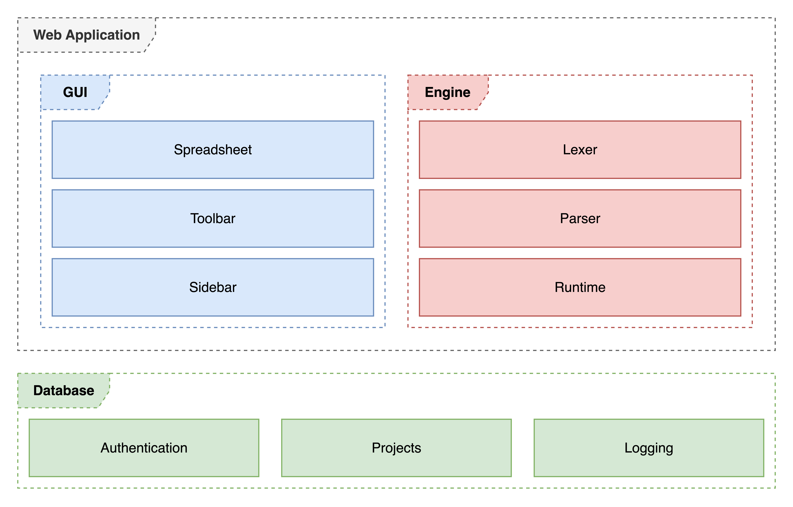
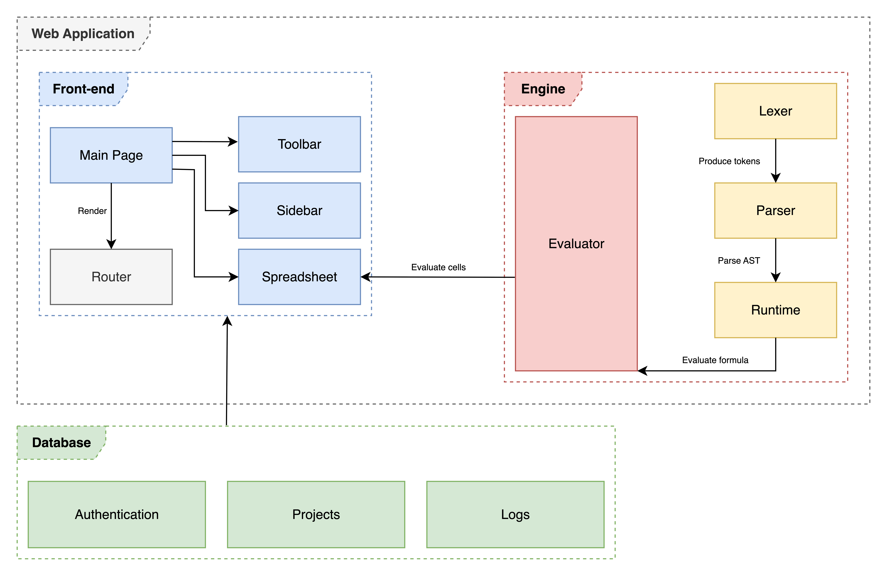

# Technical Documentation

**Project**: ABM Sheets \
**Author**: Bc. Tomáš Boďa \
**Supervisor**: Mgr. Tomáš Petříček, Ph.D.

## Table of Contents

1. [Abstract](#1-abstract)
2. [Introduction](#2-introduction)
3. [System Overview](#3-system-overview)
4. [System & Requirements](#4-system-requirements)
5. [Architecture & Design](#5-architecture--design)
6. [Implementation Details](#6-implementation-details)
7. [Database Schema](#7-database-schema)
8. [Installation & Deployment Guide](#8-installation--deployment-guide)
9. [Testing & Quality Assurance](#9-testing--quality-assurance)
10. [Limitations & Future Work](#10-limitations--future-work)
11. [References & Appendices](#11-references--appendices)

## 1. Abstract

Spreadsheets are powerful tools for data analysis and modeling, but they are inherently limited to two dimensions - rows and columns, making it difficult to represent systems that evolve over time. This limitation poses challenges for domains like agent-based modeling, physics simulations, or financial market analysis, where the concept of time is fundamental. In particular, agent-based models require tracking multiple agents, each with evolving attributes, across discrete time steps - something traditional spreadsheets struggle to express without resorting to duplication and convoluted formulas. We address this limitation by extending the spreadsheet paradigm with a built-in support for discrete time, allowing cells to reference their own values from previous time steps directly. This extension preserves the familiar spreadsheet paradigm while adding a powerful new dimension of time. With this approach, users can build and explore dynamic models, such as agent-based simulations with the same ease as traditional spreadsheet calculations.

## 2. Introduction

1. [Purpose of the Software](#21-purpose-of-the-software)
2. [Scope of the System](#22-scope-of-the-system)
3. [Target Audience](#23-target-audience)

### 2.1 Purpose of the Software

Spreadsheets are among the most widely used tools for data analysis, planning, and modeling due to their flexibility, accessibility and low barrier to entry. However, their core structural simplicity also introduces limitations for representing models that evolve over time or extend beyond the two dimensions of rows and columns.

ABM Sheets aims to extend the traditional spreadsheet paradigm with discrete time. Many domains, such as physics simulations, agent-based models, or financial markets rely on time-based processes. Conventional spreadsheets typically allocate one dimension (e.g. rows) to represent time steps, leaving only one dimension for all other aspects of the model. However, this quickly becomes restrictive for more complex domains.

In ABM Sheets, cells can reference their own past values, enabling them to update across discrete time steps. Users can step forward through time using dedicated controls and observe the spreadsheet recalculate dynamically. This simple but powerful extension adds a new temporal dimension to spreadsheets, expanding their expressive power and opening doors to new types of simulations that are difficult to model in traditional spreadsheet interfaces.

### 2.2 Scope of the System

ABM Sheets aims to copy the look and feel of conventional spreasheet interfaces, such as [Microsoft Excel](https://www.microsoft.com/en-us/microsoft-365/excel) or [Google Sheets](https://workspace.google.com/products/sheets/), while focusing on the core subset of their functionality and language features. It is not intended to be a full replacement of existing spreadsheet software, rather as a specialized tool for time-based modeling. Therefore, some advanced features might not be available.

In addition to standard spreadsheet features, ABM Sheets introduces several new language constructs and functions to fully integrate the notion of discrete time into the spreadsheet paradigm. These extensions allow users to reference past cell values, work with time ranges and define temporal relationships between cells.

### 2.3 Target Audience

ABM Sheets is designed primarily for researches, scientists and people with at least some background in spreadsheets, simulations, modeling, prototyping, mathematics, computer science, economics or physics. It is **not intended** for users with no technical experience whatsoever, since understanding the integration of time requires familiarity with spreadsheets or other form of interactive programming systems.

## 3. System Overview

1. [High-level Architecture](#31-high-level-architecture)
2. [Technology Stack](#32-technology-stack)
3. [Main Features](#33-main-features)
4. [Language Reference](#34-language-reference)

### 3.1 High-level Architecture

ABM Sheets is a web-based application written in [TypeScript](https://www.typescriptlang.org). It consists of three high-level components:

- **front-end** - spreadsheet interface, toolbar, graphs, user interactions
- **engine** - evaluates cell formulas (lexical & semantic analysis, runtime)
- **database** - authentication, user projects, logging



### 3.2 Technology Stack

ABM Sheets is built in [TypeScript](https://www.typescriptlang.org) using the following tools and frameworks:

- [Next.js](https://nextjs.org/) for front-end
- [Styled Components](https://styled-components.com/) for styling
- [Supabase](https://supabase.com/) for database and authentication

### 3.3 Main Features

The built-in support for discrete time results in several major additions to the spreadsheet:

- ability to **self-reference a cell** without recursive evaluation errors
- ability to **step through time** steps and see changes in the spreadsheet
- introduction of **time ranges** as an extension to cell ranges

Another major feature is the integration of a composable data visualisation library [Compost.js](https://compostjs.github.io/compost), which enables users to compose custom graphs directly in the spreadsheet using cells and formulas.

Lastly, some of the minor features include user authentication and ability to create, update, delete and share user projects.

1. [Built-in Time](#built-in-time)
2. [Cell References](#cell-references)
3. [Time Ranges](#time-ranges)
4. [Composable Graphs](#composable-graphs)

#### Built-in Time

The core innovation in ABM Sheets is the integration of discrete time as a native feature of the spreadsheet environment. This addition introduces several fundamental changes to how cells behave and how formulas are interpreted.

Most notably, cells in ABM Sheets are allowed to reference themselves within their own formulas. When a cell references itself, the value retrieved corresponds to the cell's value in the previous time step. To enable this behavior, each self-dependent cell must be initialized with a starting value (referred to as the default formula) from which the simulation can evolve over time.

Each cell in ABM Sheets can therefore have one or two formulas:

- **default formula** (optional) - defines the cell's value at the initial time step (`t = 1`)
- **primary formula** (mandatory) - defines the cell's value in all subsequent time steps (`t > 1`), potentially referencing its own prior state or the states of other cells

If a cell attempts to reference itself without the default formula defined, the evaluation results in an error due to the absence of an initial state.

To define both formulas within a single cell, ABM Sheets uses a dual-assignment syntax - the first `=` introduces the default formula, and the second `=` introduces the primary formula. If only one formula is provided, it is treated as the primary formula and applies uniformly across all time steps without referencing prior state.

To define a simple counter that starts at `0` and increments by `1` at each time step, the formula in cell `A1` could be `= 0 = A1 + 1`:

- at time step `1`, `A1` evaluates to `0` (the default formula)
- at time step `2`, `A1` evaluates to `0 + 1 = 1` (the primary formula)
- at time step `3`, `A1` evaluates to `1 + 1 = 2`, and so on

#### Cell References

In a spreadsheet model where cells reference themselves arbitrarily, a mechanism to ensure that all cells are evaluated in correct and consistent order must be enforced. For instance, if `A1` references `B1`, the system must make sure to evaluate `B1` prior to `A1` in order for `A1` to have the most up-to-date value of `B1`.

To enforce this ordering, ABM Sheets employs a **topological sorting algorithm** that analyzes cell dependencies and determines a valid evaluation sequence. This guarantees that each cell is computed only after all the cells it depends on have been evaluated.

However, this approach can encounter issues when cyclic dependencies exist — when two or more cells depend on each other either directly or indirectly. For instance:

- cell `A1` with formula `= B1`
- cell `B1` with formula `= A1`

This configuration creates a circular dependency, which prevents topological sorting and leads to an evaluation error. ABM Sheets addresses this problem by leveraging default formulas to break dependency cycles across time steps. By providing an initial value through a default formula, a cell can be evaluated independently at the first time step, allowing dependent cells to reference its value without forming an immediate cycle. For instance:

- `A1` formula is `= 1 = B1`
- `B1` formula is `= A1`

In this revised configuration, `A1` is initialized to `1` at the first time step. As a result, `B1` can safely reference `A1`, and both cells can be evaluated without creating a circular dependency in the current time step. In subsequent time steps, values propagate forward using the established evaluation order, maintaining consistency and correctness.

This mechanism allows ABM Sheets to support recursive and interdependent cell logic while preserving the integrity of the simulation across discrete time steps.

#### Time Ranges

Conventional spreadsheet interfaces usually provide a way to specify cell ranges using the `A5:B10` syntax. These are usually used as arguments to functions that work with cell ranges, such as `MIN`, `MAX`, `SUM`, `AVERAGE`, etc. With the addition of built-in discrete time, this naturally opens the question whether we can utilise these functions for time as well.

A cell range typically evaluates to an array of cell references that are within the cell range bounds. These cell references are then evaluated, resulting in an array of calculated values. ABM Sheets builds on this idea by generalizing the concept of ranges, which results in the ability to use cell ranges and time ranges interchangeably.

ABM Sheets provides a new function `TIMERANGE (CELL, NUMBER)`, which accepts a cell reference and a number of time steps to reference. This function takes a cell range and evaluates returns its values from the last `N` time steps. This naturally results in an array of calculated values, same as with cell ranges. This addition results in a generalized range object for both cell ranges and time ranges, which can be used in all functions that accept cell ranges in traditional spreadsheet interfaces. For instance, to calculate the average value of cell `B5` in the last `10` time steps, we can utilise the following formula: `= AVERAGE(TIMERANGE(B5, 10))`.

We see the introduction of time ranges as a natural addition to ABM Sheets in order to intergate time as a native concept of the spreadsheet interface, making it fully compliant with the spreadsheet paradigm.

#### Composable Graphs

ABM Sheets provides a way to create graphs based on the data in the spreadsheet. For this, it integrates a composable data visualisation library [Compost.js](https://compostjs.github.io/compost), which enables users to compose customk graphs directly in the spreadsheet using cells and their formulas.

The primary construct of Compost is `Shape`, which is a general representation of a graph. Compost provides a set of functions, which can be divided into five categories:

1. functions that produce `Shape` objects
2. functions that specify visual properties of `Shape` objects
3. functions that produce or transform `Scale` objects
4. functions that combine graph axes and `Shape` objects
5. functions that render the composed graphs

These functions can be composed together to build custom graphs from data in the spreadsheet. For each Compost function, a corresponding ABM Sheets function is available for use. Let's look at a short example of a line graph in ABM Sheets.

To compose a line graph, we must first generate a set of points to render onto the graph:

- `A1` - `= POINT(1, 5)`
- `A2` - `= POINT(2, 7)`
- `A3` - `= POINT(3, 3)`
- `A4` - `= POINT(4, 2)`
- `A5` - `= POINT(5, 9)`

When we have the points, we can combine them into a line:

- `B1` - `= LINE(A1:A5)`

Then, we create the graph axes and render the line into the graph:

- `B2` - `= AXES("left bottom", B1)`

Finally, we render the resulting graph:

- `B3` - `= RENDER(B2)`

The cell `B3` now holds the composed graph object representing a line graph. Using the ABM Sheets UI, we can open the graph sidebar and observe the rendered graph of cell `B3`.

Note that thanks to time ranges, we can utilise time to render dynamic graphs. Instead of generating a fixed array of points, we can create dynamic line grap:

- `A1` - `= 1 = A1 + 1` (represents the `x` coordinate of the point)
- `A2` - `= RANDBETWEEN(10, 20) = A2 + (RAND() - 0.5) * 5` (represents the `y` coordinate of the point)

Now, we can create a dynamic point object and compose a line from it's time range values:

- `B1` - `= POINT(A1, A2)`
- `B2` - `= LINE(TIMERANGE(B1, STEP()))`

The cell `B2` now contains a line graph shape with dynamic size that changes as we go forward in time.

### 3.4 Language Reference

ABM Sheets formula language provides a subset of core functions from [Microsoft Excel](https://www.microsoft.com/en-us/microsoft-365/excel). This set of functions work in the same manner and accept the same arguments. In addition, ABM Sheets provides several new functions for handling the discrete time as well as for composing dynamic [Compost.js](https://compostjs.github.io/compost) graphs.

#### Math Functions

- `ABS (NUMBER)` - returns the absolute value of the given number
- `FLOOR (NUMBER)` - returns the floor value of the given number
- `CEILING (NUMBER)` - returns the ceiling value of the given number
- `POWER (NUMBER, NUMBER)` - returns the first argument to the power of the second argument
- `PI ()` - returns the value of PI
- `SIN (NUMBER)` - returns the sine value of the given number in radians
- `COS (NUMBER)` - returns the cosine value of the given number in radians
- `TAN (NUMBER)` - returns the tangent value of the given number in radians
- `RADIANS (NUMBER)` - converts the given degrees to radians
- `LOG (NUMBER)` - returns the natural logarithm of the given number
- `EXP (NUMBER)` - returns `e` raised to the power of the given number
- `SQRT (NUMBER)` - returns the square root of the given number
- `ROUND (NUMBER, NUMBER)` - rounds the first argument to decimal places specified by the second argument
- `NORM ()` - returns a random draw from normal distribution

- `RAND ()` - returns a random floating number between `0` and `1`
- `RANDBETWEEN (NUMBER, NUMBER)` - returns a random integer in given range
- `CHOICE (...ANY)` - returns a random value from the given arguments

- `MIN (RANGE)` - returns the minimum numeric value in the given range
- `MAX (RANGE)` - returns the maximum numeric value in the given range
- `SUM (RANGE)` - returns the sum of numeric values in the given range
- `PRODUCT (RANGE)` - returns the product of the numeric values in the given range
- `AVERAGE (RANGE)` - returns the average of the numeric values in the given range
- `COUNT (RANGE)` - counts the number of cells with numeric values in the given range
- `COUNTIF (RANGE, ANY)` - counts the number of cells in the given range whose value matches with the second argument

#### Logical Functions

- `IF (BOOLEAN, ANY, ANY)` - returns the second argument if the condition is true, otherwise the third argument
- `AND (...BOOLEAN)` - returns the conjunction of the provided boolean arguments
- `OR (...BOOLEAN)` - returns the disjunction of the provided boolean arguments

#### Range Functions

- `INDEX (RANGE, NUMBER)` - returns the value of a cell from the given range with the given index
- `MATCH (ANY, RANGE)` - returns the index of a cell in the given range that matches the given value

#### String Functions

- `CONCAT (...ANY)` - concatenates the arguments into a string
- `LEFT (STRING, NUMBER)` - returns the first `N` characters of the given string
- `RIGHT (STRING, NUMBER)` - returns the last `N` characters of the given string
- `MID (STRING, NUMBER, NUMBER)` - returns a substring of the given string based on the given bounds
- `LEN (STRING)` - returns the length of the given string

#### Time Functions

- `PREV (CELL, ?NUMBER)` - returns the value of the given cell in the time step that is specified as the current time step minus the second argument (1 if the second argument is omitted)
- `STEP ()` - returns the index of the current time step
- `STEPS ()` - returns the total number of time steps
- `TIMERANGE (CELL, NUMBER)` - returns a range of values of the given cell from the current step to the current step minus the second argument

#### Graph Functions

##### Scales

- `SCALECONTINUOUS (NUMBER, NUMBER)` - creates a continuous scale that can contain value in the specified range
- `SCALECATEGORICAL (...STRING)` - creates a categorical scale that can contain categorical values specified in the given array of strings

##### Basic Shapes

- `POINT (NUMBER, NUMBER)` - compose a two-dimensional point
- `CATEGORICALCOORD (STRING | NUMBER, NUMBER | STRING)` - compose a categorial coordinate
- `TEXT (POINT, STRING, ?STRING, ?STRING)` - draws a text specified as the second parameter at a given point coordinates specified by the first parameter. The last two optional parameters specify alignment (baseline, hanging, middle, start, end, center) and rotation in radians
- `BUBBLE (POINT, NUMBER, NUMBER)` - creates a bubble (point) at the specified point coordinates. The last two parameters specify the width and height of the bubble in pixels
- `SHAPE (...POINT)` - creates a filled shape. The shape is specified as an array of points
- `LINE (...POINT)` - creates a line drawn using the current stroke color. The line is specified as an array of points
- `COLUMN (STRING, NUMBER)` - creates a filled rectangle for use in a column chart. It creates a rectangle that fills the whole area for a given categorical value and has a specified height.
- `BAR (NUMBER, STRING)` - creates a filled rectangle for use in a bar chart. It creates a rectangle that fills the whole area for a given categorical value and has a specified width.

##### Visual Properties

- `FILLCOLOR (STRING, SHAPE)` - sets the fill color to be used for all shapes drawn using c.shape in the given shape.
- `STROKECOLOR (STRING, SHAPE)` - sets the line color to be used for all lines drawn using c.line in the given shape
- `FONT (STRING, STRING, SHAPE)` - sets the font and text color to be used for all text occurring in the given shape

##### Transforming Scales

- `NEST (POINT, POINT, SHAPE)` - creates a shape that occupies an explicitly specified space using the four coordinates as left and right X value and top and bottom Y values. Inside this explicitly specified space, the nested shape is drawn, using its own scales
- `NESTX (NUMBER, NUMBER, SHAPE)` - same as above, but this primitive only overrides the X scale of the nested shape while the Y scale is left unchanged and can be shared with other shapes
- `NESTY (NUMBER, NUMBER, SHAPE)` - same as above, but this primitive only overrides the Y scale of the nested shape while the X scale is left unchanged and can be shared with other shapes
- `SCALE (SCALE, SCALE, SHAPE)` - override the automatically inferred scale with an explicitly specified one. You can use this to define a custom minimal and maximal value. To create scales use `SCALECONTINUOUS` or `SCALECATEGORIAL`
- `SCALEX (SCALE, SHAPE)` - override the automatically inferred X scale (as above)
- `SCALEY (SCALE, SHAPE)` - override the automatically inferred Y scale (as above)
- `PADDING (NUMBER, NUMBER, NUMBER, NUMBER, SHAPE)` - adds a padding around the given shape. The padding is specified as top, right, bottom, left. This will subtract the padding from the available space and draw the nested shape into the smaller space

##### Axes

- `OVERLAY (...SHAPE)` - compose a given array of shapes by drawing them all in the same chart area. This calculates the scale of all nested shapes and those are then automatically aligned based on their coordinates
- `AXES (STRING, SHAPE)` - draw axes around a given shape. The string parameter can be any string containing the words left, right, bottom and/or top, for example using space as a separator

##### Render

- `RENDER (SHAPE)` - render the given shape onto the graph

## 4. System Requirements

- hardware & software requirements
- dependencies (framework version, APIs, etc.)

## 5. Architecture & Design

- UML diagrams (class diagram, sequence diagram, component diagram, etc.)
- data model (ER diagrams, database schema)
- key design decisions & rationale

The following sections describe the architecture and design of the ABM Sheets software system.

1. [Component Diagram](#51-component-diagram)
2. [Class Diagram](#52-class-diagram)

### 5.1 Component Diagram

The ABM Sheets `Web Application` module encapsulates both the spreadsheet interface and the evaluation engine. The engine therefore runs purely in the browser, however, it cannot be considered as part of the front-end. The engine exposes the `Evaluator` module that is used as communication channel between the engine and the spreadsheet interface.

The `Database` module is a remote [Supabase](https://supabase.com) instance. All database requests are handled on the front-end by the [supabase-js](https://www.npmjs.com/package/@supabase/supabase-js/v/2.41.0) client library.



### 5.2 Class Diagram

The `SpreadsheetPage` renders both the spreadsheet interface (`SpreadsheetWrapper`) as well as the toolbar and sidebar. The `SpreadsheetWrapper` component handles all spreadsheet client-side logic, such as keyboard/mouse handlers, and uses `SpreadsheetComponent` under the hood to handle the rendering of the spreadsheet grid.

The `useSpreadsheet` hook is responsible for handling all spreadsheet-related logic and holds the current state of the spreadsheet (e.g. cell data, cell styling, etc.). It is reused across the front-end in both the primary spreadsheet grid as well as the toolbar and sidebar. The `useSelection` hook is used primarily in the `SpreadsheetWrapper` and handles cell-selection logic.

Last but not least, the `Evaluator` class is responsible for running the evaluation engine for the spreadsheet cells and returns the evaluated results back to the `SpreadsheetWrapper`. In between, there are two functions (part of the same concept) that perform topological sorting of cells before passing them to the `Evaluator`.


## 6. Implementation Details

The core of ABM Sheets is composed of the following two modules:

- **front-end** - spreadsheet interface, toolbar, sidebar, graph, user interactions
- **engine** - parses and evaluates cell formulas (lexer, parser, runtime, evaluator)

1. [Spreadsheet](#61-spreadsheet)
2. [Engine](#62-engine)
3. [Topological Sorting](#63-topological-sorting)

### 6.1 Spreadsheet

The spreadsheet interface is the most important part of the front-end module. It renders a grid of cells which the user can interact with. The spreadsheet grid consists of rows and columns, labeled by numbers and letters respectivelly.

Currently, ABM Sheets supports up to `1,000` rows and `1,000` columns, resulting in the total of `1,000,000` cells. This large amount of cells is difficult for browsers to render without any performance issues. In fact, during the development of ABM Sheets, it took about `10` seconds to render these cells. Further interactions with the rendered cells resulted in an unusable product and it needed vast optimizations to make it work.

Due to these issues, an algorithm that effectively selects which cells to render is employed to ensure smooth user experience. First and foremost, the number of cells that are rendered on the user's screen is limited by the size of their computer screen (not taking into account browser zooming). This implies that the browser only needs to render cells that are visible. One option is to track cells that are visible and only render these cells, omitting all other cells that are out of the viewport. However, listening to website scroll changes for each cell, or using complex calculations for the cell boundaries would be inefficient. Therefore, the spreadsheet is divided into smaller panels, each representing a subgrid of cells in the spreadsheet. Each panel tracks its intersection with the viewport and is rendered onto the DOM only if it becomes visible. The size of one panels corresponds roughly to the size of the viewport. This implies that in one particular moment, a maximum of `4` panels is rendered by the browser. In this way, only a small portion of the spreadsheet cells is handled by the browser's rendering engine, no matter the size of the spreadsheet, optimizing its performance and making the spreadsheet usable.

The spreadsheet module consists of two primary components:

- `SpreadsheetComponent` - generic spreadsheet rendered
- `SpreadsheetWrapper` - application-specific interaction logic

`SpreadsheetComponent` is a generic component that is responsible for handling the rendering of the cells together with the above mentioned optimizations. It takes in a parameter of type `ReactNode` corresponding to the cell component to render onto the spreadsheet. Inside this component's logic there is a React hook called `useRenderedPanels` that is subscribed to scrolling events and returns an array of visible panels that the spreadsheet should render. The `SpreadsheetComponent` then iterates over all panels, renders only panels that are visible to the user and for each panel renders an array of cells, substituting the rendered DOM element by the user-defined cell element.

`SpreadsheetWrapper` is an application-specific component that uses the `SpreadsheetComponent` to render the spreadsheet. It defines all user interaction handles, such as cell clicks, double clicks, cell selection, cell styling, etc. This is the primary component of the front-end module where most of the interaction logic lies.

### 6.2 Engine

The evaluation engine is a module that is responsible for parsing and evaluating cell formulas. It takes in an array of cell IDs and the number of steps of the simulation and evaluates each cell for each time step. Its output is a `History` object, which is a map of cell IDs and their calculated values for each time step. This object is then passed to the spreadsheet interface and rendered in the corresponding cells.

```ts
export type History = Map<CellId, Value[]>;
```

The engine module's entry point is the `Evaluator` which is a pipeline of three primary processors:

- `Lexer` - performs lexical analysis of a cell's formula
- `Parser` - validates and recursively builds the abstract syntax tree (AST) of a cell's formula
- `Runtime` = recursively traverses a cell's formula's AST and evaluates it

#### Lexer

`Lexer` is a processor responsible for the lexical analysis of a cell's formula. It accepts a cell's formula in a plain `string` format and produces an array of tokens of the formula language. A token is a single, non-dividable unit of the formula language, such as a numeric literal, identifier, comma, etc.

```ts
export enum TokenType {
    Identifier = "Identifier",
    Number = "Number",
    Boolean = "Boolean",
    String = "String",
    OpenParen = "OpenParen",
    CloseParen = "CloseParen",
    ...
}

export type Token = {
    type: TokenType;
    value: string;
};
```

If the lexer comes across a value that is not recognized by the formula language, it produces a syntax error. If no syntax errors are found, the `Lexer` returns an array of tokens and delegates them to the following processors for further analysis and transformations.

#### Parser

`Parser` is a processor responsible for the semantical analysis of a cell's formula. It is fed an array of tokens from the `Lexer`, iterates over these tokens and validates them agains the grammar rules of the formula language. If it finds a sequence of tokens that does not correspond to any grammar rule, it produces a syntax error.

As the `Parser` matches and validates the stream of tokens agains the formula language grammar, it recursively builds a so called Abstract Syntax Tree (AST) of the formula. AST is a tree structure that holds a semantic representation of the cell's formula. Its shape is determined by the meaning of the formula and holds relevant information about how the formula should be evaluated. Each node in the AST stores information about the action to perform and additional arguments or metadata used by the action.

```ts
export enum NodeType {
    NumericLiteral = "NumericLiteral",
    BinaryExpression = "BinaryExpression",
    CallExpression = "CallExpression",
    ...
}

export interface Expression {
    type: NodeType;
}

export interface NumericLiteral extends Expression {
    type: NodeType.NumericLiteral;
    value: number;
}

export interface BinaryExpression extends Expression {
    type: NodeType.BinaryExpression;
    left: Expression;
    right: Expression;
    operator: string;
}

export interface CallExpression extends Expression {
    type: NodeType.CallExpression;
    identifier: string;
    args: Expression[];
}

...
```

For instance, image a cell with formula `= 10 + 2 * 3`. We know that the `*` operator has precedence over the `+` operator and must be evaluated first. Since the evaluation is performed as recursive traversal of the AST, the `*` action must be in a layer below the `+` action. Therefore, the root node of the AST is a `BinaryExpression` node with the `+` operator. Its left operand is a `NumericLiteral` node with the value `10` and its right node is a `BinaryExpression` with the `*` operator. The left operand of the `*` node is a `NumericLiteral` node with the value of `2` and its right operand is a `NumericLiteral` node with the value of `3`. The whole AST of this formula has the following structure:

```json
{
    "type": "BinaryExpression",
    "operator": "+",
    "left": {
        "type": "NumericLiteral",
        "value": 10
    },
    "right": {
        "type": "BinaryExpression",
        "operator": "*",
        "left": {
            "type": "NumericLiteral",
            "value": 2
        },
        "right": {
            "type": "NumericLiteral",
            "value": 3
        }
    }
}
```

In this way, the multiplication is evaluated first, resulting in `2 * 3 = 6` and only after this the addition is performed, resulting in `10 + 6 = 16`. The `Parser` is responsible for building a correct AST for the given formula, which is later fed into the `Runtime` processor.

The `Parser` is implemented as a recursive-descent parser. Each grammar rule is implemented as a TypeScript function that parses the stream of tokens and produces a valid AST node, which is then inserted into the AST of the whole formula.

```ts
...

private parseAdditiveExpression(): Expression {
    let left: Expression = this.parseMultiplicativeExpression();

    while (this.at().type === TokenType.BinOp && ["+", "-"].includes(this.at().value)) {
        const operator = this.next().value;
        const right = this.parseMultiplicativeExpression();

        left = {
            type: NodeType.BinaryExpression,
            left,
            right,
            operator,
        } as BinaryExpression;
    }

    return left;
}

private parseMultiplicativeExpression(): Expression {
    let left: Expression = this.parseCallExpression();

    while (this.at().type === TokenType.BinOp && ["*", "/", "%"].includes(this.at().value)) {
        const operator = this.next().value;
        const right = this.parseCallExpression();

        left = {
            type: NodeType.BinaryExpression,
            left,
            right,
            operator,
        } as BinaryExpression;
    }

    return left;
}

...
```

As depicted in the code snippet above, the `parseAdditiveExpression` first calls the `parseMultiplicativeExpression` for both its left and right operands. This ensures that in case of multiplicative binary expression, it always sits in the lower layers of the AST than the additive binary expression, being eventually evaluated first.

#### Runtime

`Runtime` is a processor responsible for evaluating the AST of a cell's formula. It takes in a valid AST, traverses it in a recursive way and evaluates its nodes one by one. Since each node in the AST corresponds to an expression that is evaluated to a value, it produces a single value of the formula, that is later displayed in the corresponding cell in the spreadsheet interface.

There are many datatypes supported by ABM Sheets, but the most prominent ones are depicted below:

```ts
export enum ValueType {
    Number = "Number",
    Boolean = "Boolean",
    String = "String",
    ...
}

export type NumberType = number;
export type BooleanType = boolean;
export type StringType = string;
...

export interface Value {
    type: ValueType;
    value:
        | NumberType
        | BooleanType
        | StringType
        | ...
}

export interface NumberValue extends Value {
    type: ValueType.Number;
    value: NumberType;
}

export interface BooleanValue extends Value {
    type: ValueType.Boolean;
    value: BooleanType;
}

export interface StringValue extends Value {
    type: ValueType.String;
    value: StringType;
}

...
```

The `Runtime` processor traverses the AST recursively using a Depth First Search algorithm, starting from the root, progressing towards the leaf nodes. Each TypeScript function in the `Runtime` module corresponds to the processor of one AST node type, resulting in a runtime value being generated. For instace, evaluating a binary expression looks like this:

```ts
private runBinaryExpression(expression: BinaryExpression): NumberValue {
    const { left, right, operator } = expression;

    const leftValue = this.runExpression(left);
    const rightValue = this.runExpression(right);

    if (
        leftValue.type !== ValueType.Number ||
        rightValue.type !== ValueType.Number
    ) {
        throw new Error("LHS and RHS of binary expression must be numbers");
    }

    const { value: lhs } = leftValue as NumberValue;
    const { value: rhs } = rightValue as NumberValue;

    const operators = {
        "+": (lhs: number, rhs: number) => lhs + rhs,
        "-": (lhs: number, rhs: number) => lhs - rhs,
        "*": (lhs: number, rhs: number) => lhs * rhs,
        "/": (lhs: number, rhs: number) => lhs / rhs,
        "%": (lhs: number, rhs: number) => lhs % rhs,
    };

    const func = operators[operator];

    if (!func) {
        throw new Error(`Unsupported binary operator '${operator}'`);
    }

    const result: number = func(lhs, rhs);

    return { type: ValueType.Number, value: result };
}
```

#### Evaluator

`Evaluator` is the entry point of the evaluation engine module and serves as a wrapper of the above processors. Each of the processors described above (`Lexer`, `Parser`, `Runtime`) work together to evaluate a formula of a single cell. The `Runtime` processor accepts a single cell's formula as a raw `string`, calls the `Parser` processor to generate an AST, which calls the `Lexer` processor to produce tokens. Once the tokens are produced, they are passed back to the `Parser` which validates them and generates the AST and then passes the AST upwards to the `Runtime` processor, which evaluates the `AST` and produces a single runtime value.

The `Evaluator` module, on the other hand, accepts an array of cell IDs and the total number of steps. It extracts cell formulas from the cell IDs, loops over all cells and all time steps and for each cell and time step calls the `Runtime` processor to evaluate the cells formula for the specific time step. Upon evaluating all cells and time steps, it produces a `History` object which is a data structure holding the state of the entire simulation.

```ts
export type History = Map<CellId, Value[]>;

const evaluateCells = (cells: CellId[], steps: number) => {
    const history: History = new Map();

    for (let step = 0; step < steps; step++) {
        for (const cellId of cells) {
            const formula = this.getCellFormula(cellId);
            const result = new Runtime.run(cellId, formula, step, steps);
            history.set(cellId, [...history.get(cellId), result]);
        }
    }

    return history;
};
```

This `History` object is then passed to the spreadsheet interface to propagate the evaluated values to the corresponding cells.

### 6.3 Topological Sorting

Before the cell formulas are passed from the spreadsheet to the engine for evaluation, there is one more step that needs to be done to ensure correct evaluation of the cells. In spreadsheets, cells can reference each other's values arbitrarily. For instance, cell `A1` can reference cell `B2` and `C3` and `B2` can reference `D4`. These cells, however, cannot be evaluated in any order. If the engine evaluates `A1` first and `B2` second, then `A1` does not have the most up to date value of `B2`, since `B2` depends on `D4`. The engine first needs to evaluate `D4` since `B2` depends on it, then it needs to evaluate `C3` since `A1` depends on both `B2` and `C3` and finnaly it can evaluate `A1` since there are no more dependencies on `A1` that have not yet been evaluated.

For this problem, ABM Sheets uses a topological sorting algorithm that takes in an array of cell IDs and produces a sorted array of the same cell IDs in the order they need to be evaluated in to ensure correct results.

The topological sorting algorithm first builds a dependency graph. The dependency graph is an oriented graph where nodes represent cells and edges represent dependencies. If an edge is directed from `A1` to `B2` it means that `A1` is referencing `B2`. After the dependency graph is created, the topological sorting algorithm traverses this graph and builds a sorted array of cells. As it builds this array, it also checks for cycles in the graph. If a cycle has been found, there exist no topological sorting that can be used, because cells depend on themselves in a cyclical manner with no origin to start with. In that way, the cells cannot be evaluated and the algorithm produces an error.

After a topological ordering has been found, the sorted cells are passed to the `Evaluator` module for evaluation.

## 7. Database Schema

ABM Sheets uses a remote [Supabase](https://supabase.com) instance for database and authentication.

1. [Authentication](#71-authentication)
2. [Projects](#72-projects)
3. [Logging](#73-logging)

### 7.1 Authentication

Users can use ABM Sheets either with or without authentication. Creating an account provides users the benefit of saving projects to the database, which can be retrieved from anywhere using the account. Users can sign up for ABM Sheets using only their e-mail address and password.

ABM Sheets uses the built-in authentication provider (e-mail, password) by [Supabase](https://supabase.com).

### 7.2 Projects

User-created projects are stored in the `public.projects` table. This table has the following schema:

```sql
CREATE TABLE public.projects (
    id uuid NOT NULL DEFAULT gen_random_uuid(),
    user_id uuid NOT NULL DEFAULT auth.uid(),
    title text NOT NULL,
    text text,
    data jsonb NOT NULL,
    created_at timestamp without time zone NOT NULL DEFAULT now(),
    CONSTRAINT projects_pkey PRIMARY KEY (id),
    CONSTRAINT projects_user_id_fkey FOREIGN KEY (user_id) REFERENCES auth.users(id)
);
```

Each project has a unique, randomly generated `id`. The `user_id` column holds the `id` of the authenticated user who is the owner (creator) of this project. Each project has a mandatory `title` and an optional `text` attributes used for describing the project. The `data` column contains a raw `JSON` object representing the state of the spreadsheet. The structure of this object is defined by the front-end part of ABM Sheets.

### 7.3 Logging

ABM Sheets integrates a simple logging system, which fires events upon user interaction with the spreadsheet. These might include clicking on a cell, typing text to the formula field or using toolbar options.

Logs are stored in the `public.logs` table. This table has the following schema:

```sql
CREATE TABLE public.logs (
    id uuid NOT NULL DEFAULT gen_random_uuid(),
    session_id uuid NOT NULL,
    user_id uuid NOT NULL DEFAULT auth.uid(),
    type text NOT NULL,
    value text NOT NULL,
    created_at timestamp with time zone NOT NULL DEFAULT now(),
    CONSTRAINT logs_pkey PRIMARY KEY (id),
    CONSTRAINT logs_user_id_fkey FOREIGN KEY (user_id) REFERENCES auth.users(id)
);
```

Each log has a unique `id`. The `user_id` column holds the `id` of the authenticated user who is the creator of this project. The `session_id` column represents a randomly generated `UUID` by the user's browser to identify individual user sessions. Each log has a specific `type` (e.g. `cell-click`) and `value` (additional data for the event, e.g. cell ID).

## 8. Installation & Deployment Guide

1. [Deployed Version](#81-deployed-version)
2. [Running Locally](#82-running-locally)

### 8.1 Deployed Version

A running instance of ABM Sheets is deployed on [this link](https://abm-sheets-web.vercel.app). It contains the most up-to-date changes of ABM Sheets `main` branch on [GitHub](https://github.com/TomasBoda/abm-sheets-web).

### 8.2 Running Locally

To set up and run ABM Sheets locally, follow the instructions below:

1. install [Node.js](https://nodejs.org/) version `18.8` or higher (as specified in the [Next.js Documentation](https://nextjs.org/docs/app/getting-started/installation))
2. clone the project `git clone https://github.com/TomasBoda/abm-sheets-web.git`
3. navigate to the project's folder `cd abm-sheets-web`
4. install dependencies `npm install`
5. run the project `npm run dev`

In order for the application to work properly, a [Supabase](https://supabase.com) instance must be connected to the web application. You can either create a local or a remote instance. In either case, you need to create the `.env` file in the project's root with the following structure:

```env
NEXT_PUBLIC_SUPABASE_URL=...
NEXT_PUBLIC_SUPABASE_ANON_KEY=...
```

#### Remote Supabase

To create a remote Supabase instance, follow the instructions below:

1. navigate to the [Supabase](https://supabase.com) website
2. create an account or sign in to an existing account
3. create a new organization
4. create a new project in the organization
5. create the `projects` and `log` table based on the above database schema
6. set up user authentication using e-mail and password credentials
7. add `SUPABASE_URL` and `SUPABASE_ANON_KEY` to the `.env` file in the ABM Sheets project

#### Local Instance

To create a local Supabase instance, follow the instructions below:

1. follow the steps on this [Supabase Docs Page](https://supabase.com/docs/guides/local-development)
2. open the Supabase dashboard locally on `http://localhost:54323`
3. create the `projects` and `log` table based on the above database schema
4. set up user authentication using e-mail and password credentials
5. add `SUPABASE_URL` and `SUPABASE_ANON_KEY` to the `.env` file in the ABM Sheets project

## 9. Testing & Quality Assurance

No automated tests have been created for this project.

## 10. Limitations & Future Work

- known issues
- possible improvements

## 11. References & Appendices

- bibliography, technical references
- full source code (if required)
