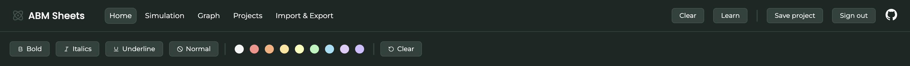

# User Documentation

**Project**: ABM Sheets
**Author**: Bc. Tomáš Boďa
**Supervisor**: Mgr. Tomáš Petříček, Ph.D.

## 1. Abstract

Spreadsheets are powerful tools for data analysis and modeling, but they are inherently limited to two dimensions - rows and columns, making it difficult to represent systems that evolve over time. This limitation poses challenges for domains like agent-based modeling, physics simulations, or financial market analysis, where the concept of time is fundamental. In particular, agent-based models require tracking multiple agents, each with evolving attributes, across discrete time steps - something traditional spreadsheets struggle to express without resorting to duplication and convoluted formulas. We address this limitation by extending the spreadsheet paradigm with a built-in support for discrete time, allowing cells to reference their own values from previous time steps directly. This extension preserves the familiar spreadsheet paradigm while adding a powerful new dimension of time. With this approach, users can build and explore dynamic models, such as agent-based simulations with the same ease as traditional spreadsheet calculations.

## 2. Getting Started

### Sign Up & Sign Up

Upon opening the ABM Sheets web application, you will see the landing page with a headline, a short description, a screenshot and two buttons.

To open the spreadsheet, click on the `Get started` button.

You can use ABM Sheets as a guest user, however, creating an account and signing in provides several benefits, such as saving projects to the databse. To sign in to your account, click the `Sign in` button located in the top right part of the screen. You will be redirected to the sign in page where you can sign in to your account using e-mail and password.

If you wish to create a new account, click on the `Sign up` button on the bottom of the form. You will be redirected to the sign up page where you can create an account using e-mail and password.

After signing in or creating an account, you will be redirected to the spreadsheet and can start using it as an authenticated user.

### Spreadsheet

The spreadsheet page consists of two main parts:

- **toolbar** - controls of the spreadsheet
- **spreadsheet** - interactive grid of cells

The toolbar consists of five navigation buttons. Each button opens a different set of controls for the user.

The `Home` tab provides controls for styling cells. The user can change the font style (bold, italic, underline) or the background color of cells.

The `Simulation` tab provides controls of the simulations and time steps. On the left side, there is a small text field that indicates the current time step. The arrow buttons on the left and right side of the text field increment/decrement the current time step, recalculating the spreadsheet on click. Then, there is a text field with the total number of steps. The user can change the number of steps by writing in a custom value into the text field. The `Reset` button resets the current time step to `1`. On the right side, there is the `Play` button that automatically plays the simulation from time step `1` to the final time step. The text field on the left side of the `Play` button specifies the number of milliseconds between each time step when the simulation is playing.

The `Import & Export` tab provides options to export the current spreadsheet to a local `.json` file and importing a local spreadsheet export to the spreadsheet. The text field on the left side of the `Export` button specifiec the name of the exported file to be downloaded to the user's computer.

The `Graph` and `Projects` tabs open a sidebar with additional controls of the spreadsheet.

If the user is authenticated, the `Projects` tab opens a sidebar with a list of user projects. The user can click on a project to open it in the spreadsheet or can delete it by clicking the `Trash` icon on the right side of the project.

The `Graph` tab opens a sidebar where the user can render a custom graph. More about the `Graph` tab will be explained later in this document.

## 3. Basic Concepts

Spreadsheet overview (rows, columns, cells)
The concept of time steps in ABM Sheets
How ABM Sheets differs from Excel/Google Sheets

In ABM Sheets, you can click on a cell and start typing in on the keyboard to input a value to the cell. Cells can either contain plain, static values, or formulas. All values starting with the `=` sign are considered as formulas, whereas other values are considered as plain values.

<video controls><source src="./videos/video-1.mov" type="video/mp4"></source></video>

ABM Sheets supports a subset of Microsoft Excel functions that can be used to calculate new values from existing values in the spreadsheet.

<video controls><source src="./videos/video-2.mov" type="video/mp4"></source>

## 4. Concept of Time

In ABM Sheets, a cell can have either one or two formulas. If two formulas are specified, the first formula is calculated in the time step `t = 1`, whereas the second formula is used in all subsequent time steps `t > 1`. If only one formula is specified, it is used in all time steps `t >= 1`.

To create a simple time-aware cell that represents a simple counter that starts at `1` and increments in each new time step by `1`, we can utilize the dual formula together with a self-reference.

<video controls><source src="./videos/video-3.mov" type="video/mp4"></source>

This time-aware cell counter is equivalent to the below table in conventional spreadsheet tools.

<video controls><source src="./videos/video-4.mov" type="video/mp4"></source>

Another addition that ABM Sheets provides is the `PREV` function used to retrieve the previous time value of a cell.

Let's define the same counter as in the previous video. On the right, we define four cells:

- `C2` references `B2` directly
- `C3` references `PREV(B2)` (value of `B2` one time step before)
- `C4` references `PREV(B2, 2)` (value of `B2` two time steps before)
- `C5` references `PREV(B2, 3)` (value of `B2` three time steps before)

Notice what values the `C` column contains as we step through time.

<video controls><source src="./videos/video-5.mov" type="video/mp4"></source>

Last but not least, ABM Sheets generalizes and unifies cell ranges with time ranges, making their use interchangable.

We can use the `SUM` functions to sum a range of values on the spreadsheet. However, in ABM Sheets, we can use the `TIMERANGE` function to create a range of historical values from a single cell and use the `SUM` function to sum their values as time changes.

<video controls><source src="./videos/video-6.mov" type="video/mp4"></source>

## 5. Graphs & Visualisation

ABM Sheets integrates a composable data visualisation library [Compost.js](https://compostjs.github.io/compost), which enables users to compose custom graphs directly in the spreadsheet using cells and formulas.

To create a simple line graph, we first need to define a set of two-dimensional `POINT` objects, compose them using the `LINE` function, define axes using the `AXES` function and finally render the graph using the `RENDER` function. When we open the `Graph` sidebar in the toolbar, we can see the rendered graph of the specified points.

<video controls><source src="./videos/video-7.mov" type="video/mp4"></source>

Thanks to generalized ranges, we can utilise the `TIMERANGE` function to build the same graph, but dynamic.

<video controls><source src="./videos/video-8.mov" type="video/mp4"></source>

## 6. Projects

### 6.1 Cloud Projects

When the user is authenticated, they can create and save a project to their account, that can be accessed on any device with the same account.

<video controls><source src="./videos/video-9.mov" type="video/mp4"></source>

If the user has created a project and has updated the spreadsheet, they can save the changes to the database.

<video controls><source src="./videos/video-10.mov" type="video/mp4"></source>

If the user decides to remove a project, they can do so in the projects sidebar.

<video controls><source src="./videos/video-11.mov" type="video/mp4"></source>

### 6.2 Import & Export

The user can also export a project to a local `.json` file.

<video controls><source src="./videos/video-12.mov" type="video/mp4"></source>

The user can then import an existing local `.json` export to the spreadsheet.

<video controls><source src="./videos/video-13.mov" type="video/mp4"></source>

## 7. Language Reference

ABM Sheets formula language provides a subset of core functions from [Microsoft Excel](https://www.microsoft.com/en-us/microsoft-365/excel). This set of functions work in the same manner and accept the same arguments. In addition, ABM Sheets provides several new functions for handling the discrete time as well as for composing dynamic [Compost.js](https://compostjs.github.io/compost) graphs.

### 7.1 Math Functions

- `ABS (NUMBER)` - returns the absolute value of the given number
- `FLOOR (NUMBER)` - returns the floor value of the given number
- `CEILING (NUMBER)` - returns the ceiling value of the given number
- `POWER (NUMBER, NUMBER)` - returns the first argument to the power of the second argument
- `PI ()` - returns the value of PI
- `SIN (NUMBER)` - returns the sine value of the given number in radians
- `COS (NUMBER)` - returns the cosine value of the given number in radians
- `TAN (NUMBER)` - returns the tangent value of the given number in radians
- `RADIANS (NUMBER)` - converts the given degrees to radians
- `LOG (NUMBER)` - returns the natural logarithm of the given number
- `EXP (NUMBER)` - returns `e` raised to the power of the given number
- `SQRT (NUMBER)` - returns the square root of the given number
- `ROUND (NUMBER, NUMBER)` - rounds the first argument to decimal places specified by the second argument
- `NORM ()` - returns a random draw from normal distribution

- `RAND ()` - returns a random floating number between `0` and `1`
- `RANDBETWEEN (NUMBER, NUMBER)` - returns a random integer in given range
- `CHOICE (...ANY)` - returns a random value from the given arguments

- `MIN (RANGE)` - returns the minimum numeric value in the given range
- `MAX (RANGE)` - returns the maximum numeric value in the given range
- `SUM (RANGE)` - returns the sum of numeric values in the given range
- `PRODUCT (RANGE)` - returns the product of the numeric values in the given range
- `AVERAGE (RANGE)` - returns the average of the numeric values in the given range
- `COUNT (RANGE)` - counts the number of cells with numeric values in the given range
- `COUNTIF (RANGE, ANY)` - counts the number of cells in the given range whose value matches with the second argument

### 7.2 Logical Functions

- `IF (BOOLEAN, ANY, ANY)` - returns the second argument if the condition is true, otherwise the third argument
- `AND (...BOOLEAN)` - returns the conjunction of the provided boolean arguments
- `OR (...BOOLEAN)` - returns the disjunction of the provided boolean arguments

### 7.3 Range Functions

- `INDEX (RANGE, NUMBER)` - returns the value of a cell from the given range with the given index
- `MATCH (ANY, RANGE)` - returns the index of a cell in the given range that matches the given value

### 7.4 String Functions

- `CONCAT (...ANY)` - concatenates the arguments into a string
- `LEFT (STRING, NUMBER)` - returns the first `N` characters of the given string
- `RIGHT (STRING, NUMBER)` - returns the last `N` characters of the given string
- `MID (STRING, NUMBER, NUMBER)` - returns a substring of the given string based on the given bounds
- `LEN (STRING)` - returns the length of the given string

### 7.5 Time Functions

- `PREV (CELL, ?NUMBER)` - returns the value of the given cell in the time step that is specified as the current time step minus the second argument (1 if the second argument is omitted)
- `STEP ()` - returns the index of the current time step
- `STEPS ()` - returns the total number of time steps
- `TIMERANGE (CELL, NUMBER)` - returns a range of values of the given cell from the current step to the current step minus the second argument

### 7.6 Graph Functions

- `SCALECONTINUOUS (NUMBER, NUMBER)` - creates a continuous scale that can contain value in the specified range
- `SCALECATEGORICAL (...STRING)` - creates a categorical scale that can contain categorical values specified in the given array of strings

 

- `POINT (NUMBER, NUMBER)` - compose a two-dimensional point
- `CATEGORICALCOORD (STRING | NUMBER, NUMBER | STRING)` - compose a categorial coordinate
- `TEXT (POINT, STRING, ?STRING, ?STRING)` - draws a text specified as the second parameter at a given point coordinates specified by the first parameter. The last two optional parameters specify alignment (baseline, hanging, middle, start, end, center) and rotation in radians
- `BUBBLE (POINT, NUMBER, NUMBER)` - creates a bubble (point) at the specified point coordinates. The last two parameters specify the width and height of the bubble in pixels
- `SHAPE (...POINT)` - creates a filled shape. The shape is specified as an array of points
- `LINE (...POINT)` - creates a line drawn using the current stroke color. The line is specified as an array of points
- `COLUMN (STRING, NUMBER)` - creates a filled rectangle for use in a column chart. It creates a rectangle that fills the whole area for a given categorical value and has a specified height.
- `BAR (NUMBER, STRING)` - creates a filled rectangle for use in a bar chart. It creates a rectangle that fills the whole area for a given categorical value and has a specified width.

 

- `FILLCOLOR (STRING, SHAPE)` - sets the fill color to be used for all shapes drawn using c.shape in the given shape.
- `STROKECOLOR (STRING, SHAPE)` - sets the line color to be used for all lines drawn using c.line in the given shape
- `FONT (STRING, STRING, SHAPE)` - sets the font and text color to be used for all text occurring in the given shape

 

- `NEST (POINT, POINT, SHAPE)` - creates a shape that occupies an explicitly specified space using the four coordinates as left and right X value and top and bottom Y values. Inside this explicitly specified space, the nested shape is drawn, using its own scales
- `NESTX (NUMBER, NUMBER, SHAPE)` - same as above, but this primitive only overrides the X scale of the nested shape while the Y scale is left unchanged and can be shared with other shapes
- `NESTY (NUMBER, NUMBER, SHAPE)` - same as above, but this primitive only overrides the Y scale of the nested shape while the X scale is left unchanged and can be shared with other shapes
- `SCALE (SCALE, SCALE, SHAPE)` - override the automatically inferred scale with an explicitly specified one. You can use this to define a custom minimal and maximal value. To create scales use `SCALECONTINUOUS` or `SCALECATEGORIAL`
- `SCALEX (SCALE, SHAPE)` - override the automatically inferred X scale (as above)
- `SCALEY (SCALE, SHAPE)` - override the automatically inferred Y scale (as above)
- `PADDING (NUMBER, NUMBER, NUMBER, NUMBER, SHAPE)` - adds a padding around the given shape. The padding is specified as top, right, bottom, left. This will subtract the padding from the available space and draw the nested shape into the smaller space

 

- `OVERLAY (...SHAPE)` - compose a given array of shapes by drawing them all in the same chart area. This calculates the scale of all nested shapes and those are then automatically aligned based on their coordinates
- `AXES (STRING, SHAPE)` - draw axes around a given shape. The string parameter can be any string containing the words left, right, bottom and/or top, for example using space as a separator

 

- `RENDER (SHAPE)` - render the given shape onto the graph
